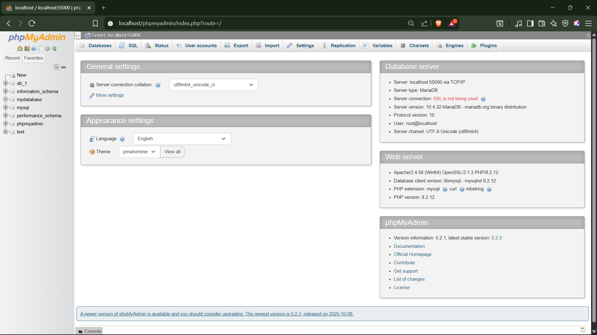
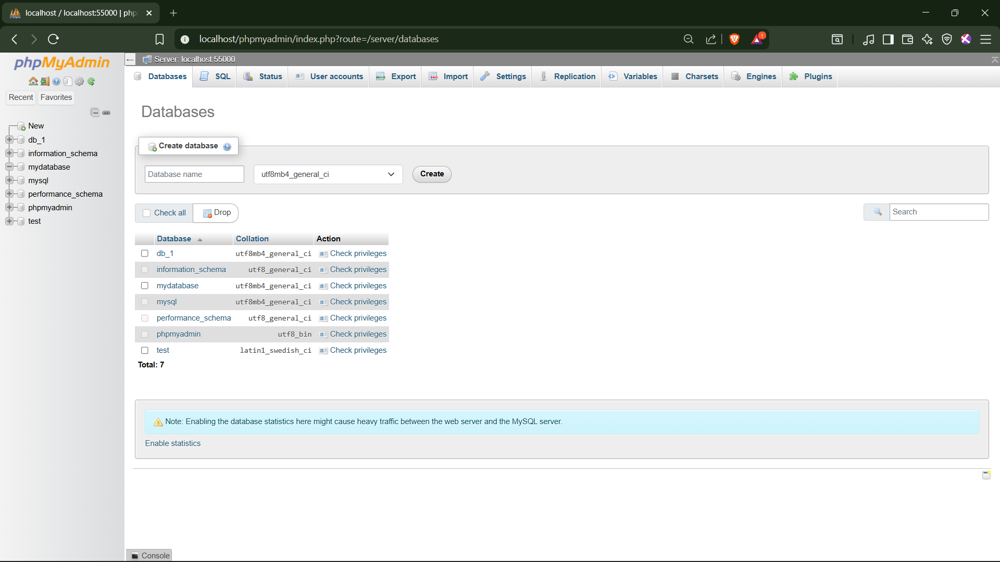
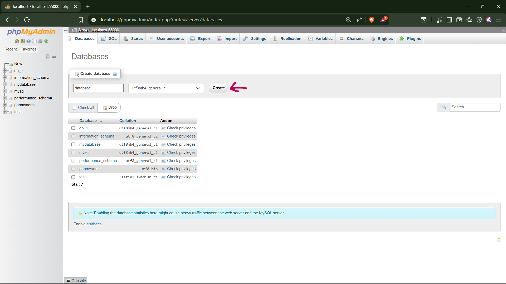
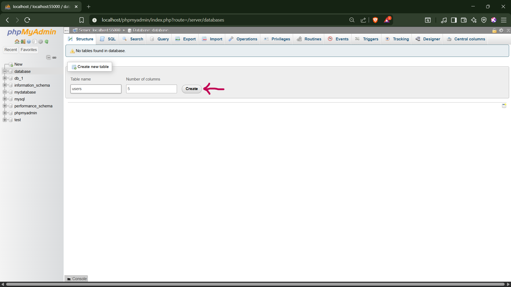
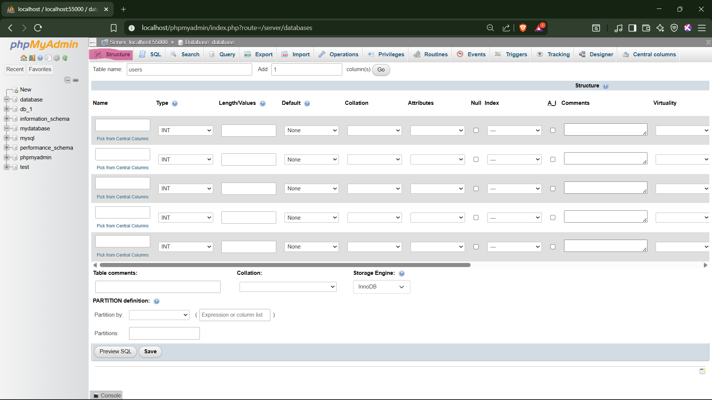
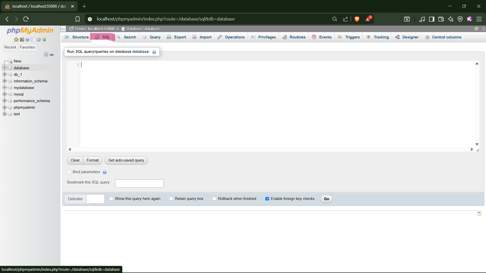

## Type in your browser : http://localhost/phpmyadmin/
you will see exacly like this photo

## Go top bar Database section

## Name a database and click the button create

## This is has two input box one is for table name and another for column numbers

## This is a bit overwhelming we will not follow this approach 

## Select the database you created recently, click top bar SQL and we are going to write SQL query in here
